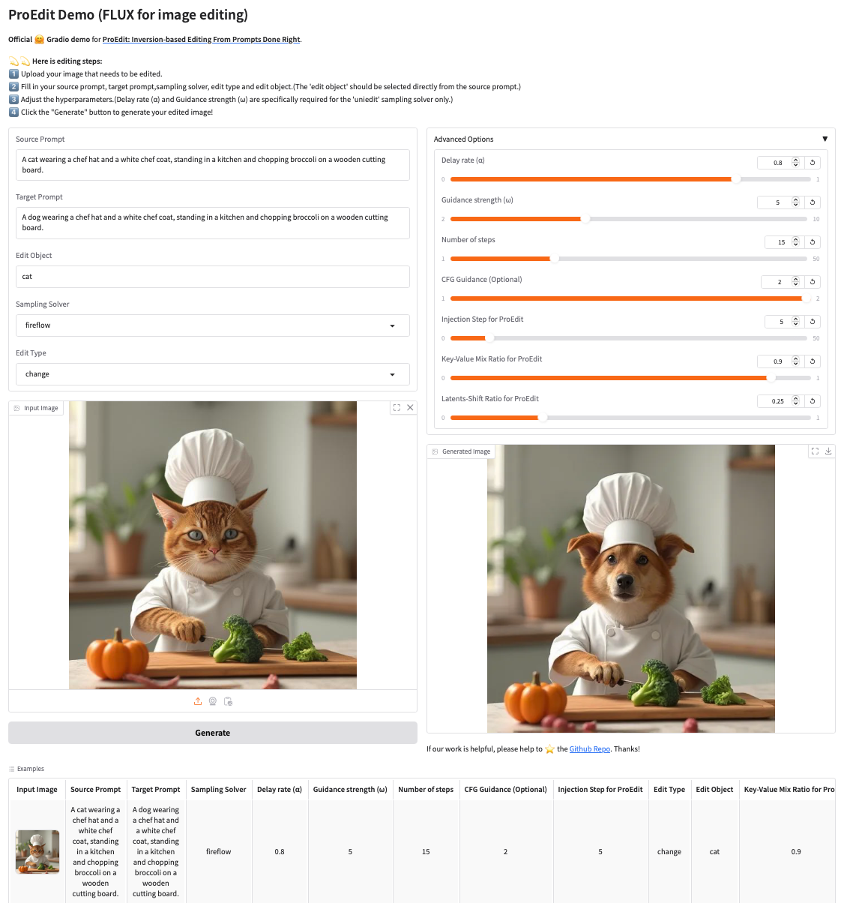

<div align="center">
  
# 🖼️ Image Editing Using FLUX

</div>

## 🛠️ Code Setup
The environment of our code is the same as FLUX, you can refer to the [official repo](https://github.com/black-forest-labs/flux/tree/main) of FLUX, or running the following command to construct the environment.
```
conda create --name ProEdit-ImageEdit python=3.10
conda activate ProEdit-ImageEdit

cd YOUR_WORKSPACE/ProEdit/Image_Edit_FLUX
pip install -e ".[all]"
```

## 🧪 Examples
You can run the following commands to perform image editing:
```
cd YOUR_WORKSPACE/ProEdit/Image_Edit_FLUX/src

# 🎨 Editing by ProEdit
# We recommand kv_mix_ratio={0.8, 0.85, 0.9}, ls_ratio={0.25, 0.3, 0.35, 0.4, 0.45, 0.5}
# guidance could be {1.0, 1.5, 2.0}

# Solver: Flow/RF-Solver/Fireflow
# inject could be set to a number between 2 to 15
python edit.py  --source_prompt [image description] \
                --target_prompt [description of your editing target] \
                --source_img_dir [your image path] \
                --output_dir [folder you want to save the results]
                --sampling_solver [reflow/rf_solver/fireflow] \
                --num_steps 15 \
                --name 'flux-dev' \
                --guidance 2 \
                --inject 5 \
                --edit_object [editing object] \
                --edit_type [editing type: change/remove/add/style] \
                --kv_mix_ratio 0.9 \
                --ls_ratio 0.25 \

# Solver: UniEdit-Flow
# We recommend alpha={0.6, 0.7, 0.75, 0.8}, omega=5.0
# inject could be set to a number between 1 to 8
python edit.py  --source_prompt [image description] \
                --target_prompt [description of your editing target] \
                --source_img_dir [your image path] \
                --output_dir [folder you want to save the results]
                --sampling_solver 'uniedit' \
                --alpha 0.8 \
                --omega 5.0 \
                --num_steps 15 \
                --name 'flux-dev' \
                --guidance 2 \
                --inject 2 \
                --edit_object [editing object] \
                --edit_type [editing type: change/remove/add/style] \
                --kv_mix_ratio 0.9 \
                --ls_ratio 0.25 \
```
The ```--inject``` refers to the steps of KV-mix in ProEdit.

## 🎡 Gradio GUI
You can also use the gradio GUI for easy image editing by running the following command:
```
python gradio_demo.py
```
Here we have provided some examples for users to have a fast test. There is a preview of the 🎡 GUI:


## 🖋️ Citation
If you find our work helpful, please star 🌟 this repo and cite 📑 our paper. Thanks for your support!
```bibtex
@article{ouyang2025proedit,
  title={ProEdit: Inversion-based Editing From Prompts Done Right},
  author={Ouyang, Zhi and Zheng, Dian and Wu, Xiao-Ming and Jiang, Jian-Jian and Lin, Kun-Yu and Meng, Jingke and Zheng, Wei-Shi},
  journal={arXiv preprint arXiv:2512.22118},
  year={2025}
}
```