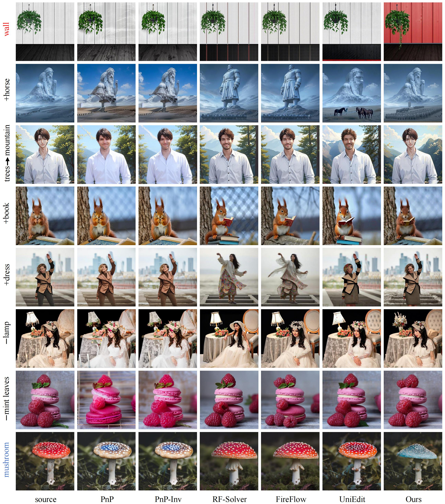
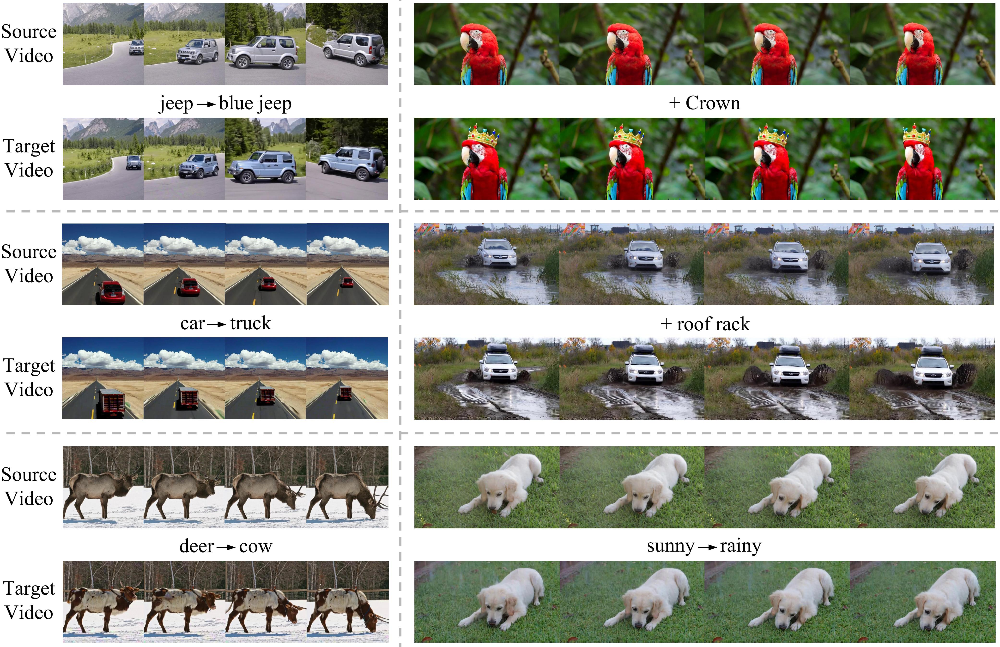

<h1>ProEdit: Inversion-based Editing From Prompts Done Right</h1>

[](https://arxiv.org/abs/2503.21755) [](https://vchitect.github.io/VBench-2.0-project/)

This repository contains the implementation of the following paper.
> **ProEdit: Inversion-based Editing From Prompts Done Right**<br>
> [Zhi Ouyang](https://github.com/ouyangzhi1)<sup>∗</sup>, [Dian Zheng](https://zhengdian1.github.io)<sup>∗</sup>, [Xiao-Ming Wu](https://dravenalg.github.io), [Jian-Jian Jiang](https://jianjian-jiang.github.io), [Kun-Yu Lin](https://kunyulin.github.io), [Jingke Meng](https://isee-ai.cn/~mengjingke/)<sup>+</sup>, [Wei-Shi Zheng](https://www.isee-ai.cn/~zhwshi/)<sup>+</sup><br>

### Table of Contents
- [:fire: Updates](#fire-updates)
- [:mega: Overview](#mega-overview)
- [📋 ToDo List](#-todo-list)
- [📖 Pipeline](#-pipeline)
- [✨ Text-driven Image / Video Editing](#-text-driven-image--video-editing)
  - [🎨 Image Editing](#-image-editing)
  - [🎥 Video Editing](#-video-editing)
- [🎓 Editing by Instruction](#-editing-by-instruction)
- [✒️ Citation](#️-citation)
- [:hearts: Acknowledgement](#hearts-acknowledgement)

## :fire: Updates
- **[2025.12.28]** The paper **ProEdit** is released on arXiv. 🚀

## :mega: Overview

<b>Overview of ProEdit.</b> We propose a highly accurate, plug-and-play editing method for flow inversion that addresses the problem of excessive source image information injection, which prevents proper modification of attributes such as pose, number, and color. Our method has demonstrated impressive performance in both image editing and video editing tasks.

## 📋 ToDo List
- [ ] Release the code for image editing(in two weeks)
- [ ] Release the code for video editing

## 📖 Pipeline

<b>Pipeline of our ProEdit. </b>The mask extraction module identifies the edited region based on source and target prompts during the first inversion step. After obtaining the inverted noise, we apply Latents-Shift to perturb the initial distribution in the edited region, reducing source image information. In selected sampling steps, we fuse source and target attention features in the edited region while directly injecting source features in non-edited regions to achieve accurate attribute editing and background preservation simultaneously.

## ✨ Text-driven Image / Video Editing
More results can be found in our project page.
### 🎨 Image Editing

### 🎥 Video Editing


## 🎓 Editing by Instruction

With the assistance of a large language model, our method can directly perform edits guided by editing instructions.

## ✒️ Citation
If you find our repo useful for your research, please consider citing our paper:
```bibtex
@misc{ouyang2025proedit,
      title={ProEdit: Inversion-based Editing From Prompts Done Right}, 
      author={Zhi Ouyang and Dian Zheng and Xiao-Ming Wu and Jian-Jian Jiang and Kun-Yu Lin and Jingke Meng and Wei-Shi Zheng},
      year={2025},
      eprint={2512.22118},
      archivePrefix={arXiv},
      primaryClass={cs.CV},
      url={https://arxiv.org/abs/2512.22118}
}
```

## :hearts: Acknowledgement
<!-- **ProEdit** is currently maintained by [Zhi Ouyang](https://github.com/ouyangzhi1) and [Dian Zheng](https://zhengdian1.github.io/).
#### :hugs: Open-Sourced Repositories -->
We sincerely thank [FireFlow](https://github.com/HolmesShuan/FireFlow-Fast-Inversion-of-Rectified-Flow-for-Image-Semantic-Editing), [RF-Solver](https://github.com/wangjiangshan0725/RF-Solver-Edit), [UniEdit-Flow](https://github.com/DSL-Lab/UniEdit-Flow/tree/main) and [FLUX](https://github.com/black-forest-labs/flux) for their awesome work!
Additionally, we would also like to thank [Pnp-Inversion](https://github.com/cure-lab/PnPInversion) for providing comprehensive baseline survey and implementations, as well as their great benchmark.
